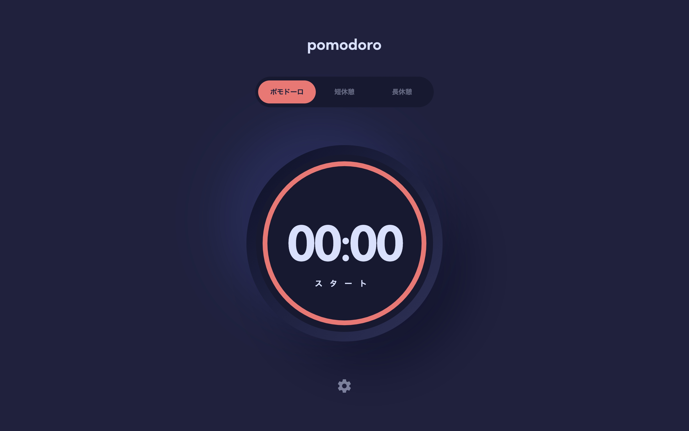

# Frontend Mentor - Pomodoro app solution

This is a solution to the [Pomodoro app challenge on Frontend Mentor](https://www.frontendmentor.io/challenges/pomodoro-app-KBFnycJ6G). Frontend Mentor challenges help you improve your coding skills by building realistic projects.

## Table of contents

- [Frontend Mentor - Pomodoro app solution](#frontend-mentor---pomodoro-app-solution)
  - [Table of contents](#table-of-contents)
  - [Overview](#overview)
    - [The challenge](#the-challenge)
    - [Keyboard Navigation](#keyboard-navigation)
    - [Screenshot](#screenshot)
    - [Links](#links)
  - [My process](#my-process)
    - [Built with](#built-with)
    - [What I learned](#what-i-learned)

## Overview

### The challenge

Users should be able to:

- Set a pomodoro timer and short & long break timers
- Customize how long each timer runs for
- See a circular progress bar that updates every minute and represents how far through their timer they are
- Customize the appearance of the app with the ability to set preferences for colors and fonts

### Keyboard Navigation

|                   Key                    | Action                       |
| :--------------------------------------: | ---------------------------- |
| <kbd>1</kbd>, <kbd>2</kbd>, <kbd>3</kbd> | Select clock type            |
|               <kbd>P</kbd>               | Start/resume/pause the clock |

### Screenshot

Home Mobile

Settings Mobile

Home Tablet

Settings Tablet

Home desktop

Settings desktop

### Links

- [Live Site URL](https://pomodoro.frilly.dev/)

## My process

### Built with

- [Astro](https://astro.build/)
- [Vue](https://vuejs.org)
- [Tailwind CSS](https://tailwindcss.com/)
- [Nanostores](https://github.com/nanostores/)

### What I learned

I learned how to work with the circular progress bar using `stroke-dasharray` and `<svg>` element. That's kinda weird, but okay to work with for an animatable.
